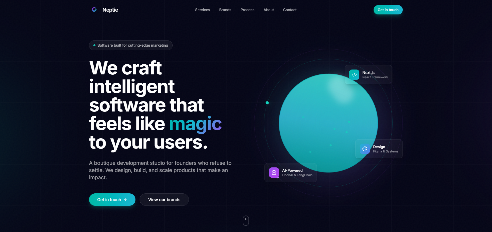

# Neptie

**Website:** [neptie.com](https://www.neptie.com)  
**Tagline:** *Software built for cutting-edge marketing*

<p align="center">
  
</p>

---

## Company overview

**Neptie** is a boutique development studio for founders who refuse to settle. The team designs, builds, and scales products that make an impact—specializing in **full-stack products**, **AI integrations**, and **marketing technology (martech)**.

### Positioning

- **Headline:** We craft intelligent software that feels like *magic* to your users.
- **Focus:** End-to-end product work with no handoffs or silos—one team aligned on client success.
- **Stack & themes:** Next.js, TypeScript, modern web, OpenAI, LangChain, design systems (Figma), PostgreSQL, Supabase—aligned with serious product and martech builds.

### Who Neptie builds for

SaaS founders, high-growth startups, digital agencies, enterprise teams, venture-backed companies, product leaders, tech entrepreneurs, and innovation labs.

### Services

| Area | What Neptie delivers |
|------|----------------------|
| **Product design** | UX strategy, UI, design systems, prototyping, user research (Figma-first). |
| **Full-stack development** | Database through deployment—Next.js, TypeScript, PostgreSQL, Supabase, and related stack. |
| **AI integrations** | Chatbots, content generation, automation, custom ML—OpenAI, LangChain, vector DBs, custom models. |
| **Technical strategy** | Fractional CTO-style support: architecture, team building, code audits, scaling. |

### Brands (in-house products)

Neptie also ships its own products, including:

| Brand | URL | Summary |
|-------|-----|---------|
| **Reacho** | [reacho.io](https://reacho.io) | AI-powered outreach—connect with ideal customers at scale. |
| **Scrollbird** | [scrollbird.com](https://scrollbird.com) | Social management—scheduling and engagement analytics. |

### Process

1. **Discover** — Business, users, and technical context; clear definition of success.  
2. **Design** — Wireframes to high-fidelity UI; usability and craft.  
3. **Build** — Iterative sprints, clean code, steady communication.  
4. **Launch & iterate** — Ship, monitor, optimize from real usage.

### Why Neptie (differentiators)

- **Founder mindset** — Not only client work; Neptie builds and launches products like Reacho and Scrollbird.  
- **Design + engineering together** — Designers and engineers collaborate so execution stays pixel-aware.  
- **Deep AI & automation** — Practical LLM and automation integrations, not hype-only.  
- **Battle-tested** — Experience shipping, scaling, and learning from live products.

### Contact (live site)

On **neptie.com**, leads can reach out for a discovery call (typically within 24 hours). This static repo uses **hello@neptie.com** / **neptie.com** as reference contact points where forms are demos.

---

## Reference: saved marketing site snapshot

In the parent **Github_building** folder you may have:

- **`Neptie _ Software Built for Cutting-Edge Marketing.html`** — Saved page from [neptie.com](https://www.neptie.com) (Next.js export).
- **`Neptie _ Software Built for Cutting-Edge Marketing_files/`** — Assets from that save (e.g. `logo(1).png`, CSS/JS chunks).

Use those files for **design and copy reference** only. The canonical, up-to-date experience is always **https://www.neptie.com**. This **`landing-page/`** project is a lighter static site (HTML/CSS) that mirrors brand and messaging; it is not a copy of the full Next.js app.

---

## This repository (`landing-page/`)

| Page | Purpose |
|------|---------|
| **`index.html`** | Static marketing homepage; hero uses **`background.png`** + `css/neptie.css`. |
| **`directory.html`** | Builder directory (names manifest + GitHub deep links). |
| **`contact.html`**, **`about.html`**, **`projects.html`**, **`blog.html`** | Supporting pages / placeholders. |

**SEO:** Canonicals target `https://neptie.com/`. Point DNS and HTTPS when you deploy.

### Quick start (local)

```bash
cd landing-page
python -m http.server 8000
# http://localhost:8000
```

### Builder directory (contributors)

1. Add `names/your_username.json`: `{ "name": "your_username" }`  
2. Include the filename in `names/manifest.json` for local testing (or rely on your GitHub Action).  
3. **`directory.html`** — **Open on GitHub** uses `https://github.com/jose-puentes/neptiehub/tree/main/<project>/<username>` — change in **`js/script.js`** if needed.

### Styling

- **`css/styles.css`** — Shared layout, nav, forms, theme toggle.  
- **`css/neptie.css`** — Neptie homepage theme (teal/violet, hero).

---

## License / support

**Neptie** — questions via issues or **neptie.com** / **hello@neptie.com**.

© Neptie. All rights reserved.
